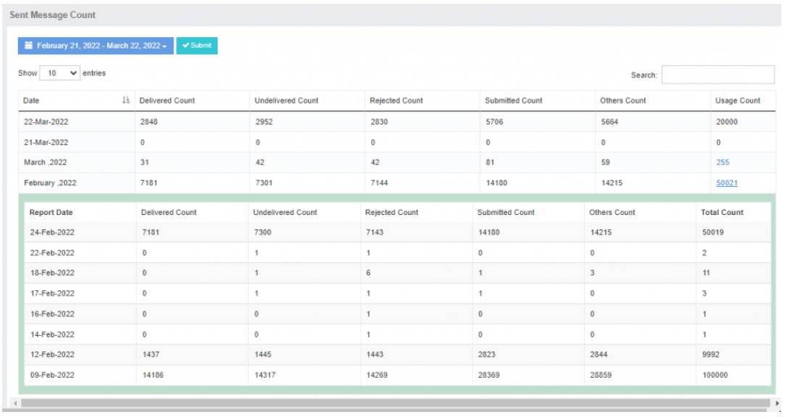

## Message Count: Status-wise SMS Traffic Analysis

The **Message Count** feature in iTextPro provides a detailed, status-wise analysis of SMS traffic.  
It allows users to monitor delivery performance and usage trends over a selected time period.

---

### Key Features

- **Status-wise Count**  
  View message counts categorized by status (e.g., Delivered, Pending, Failed).  
  Helps identify delivery performance and traffic distribution.

- **Date Range Selection**  
  Select a specific **date range** to view message counts for that period.

- **Monthly Summary with Drill-down**  
  When a specific month is selected, the system displays the **total SMS/Usage count** by default.  
  A **hyperlink** allows drilling down into a detailed **date-wise summary report**.

- **Time Zone Accuracy**  
  All message counts are displayed according to the user’s configured time zone.

---

### Steps to View Message Count

1. **Access Message Count**  
   Navigate to the **Message Count** section in iTextPro.

2. **Select Date Range**  
   Choose the desired date range or month.

3. **Explore Monthly Summary**  
   If a month is selected, click the hyperlink to view a detailed **day-by-day breakdown**.

---

**Tip:** Use the date range and status filters together for more targeted traffic analysis.
