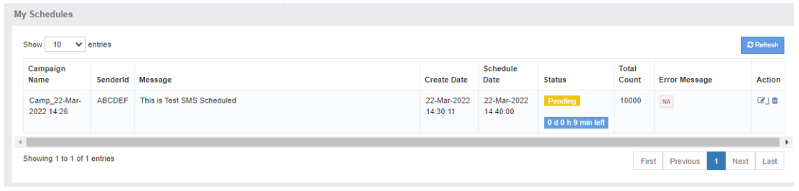
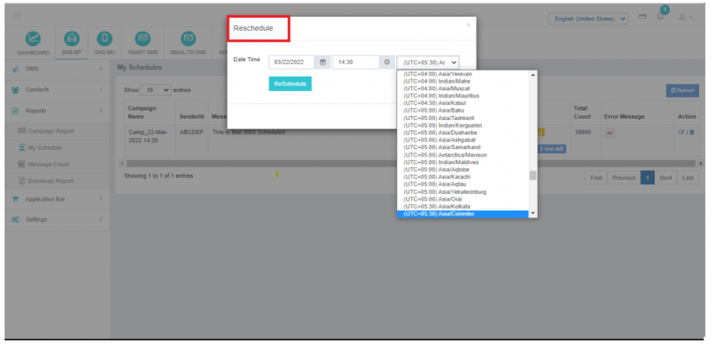

## My Schedule

The **My Schedule** feature in iTextPro streamlines the tracking and management of scheduled campaigns.  
It allows users to:
- Monitor the status of scheduled campaigns
- Make adjustments to pending campaigns
- Ensure timely and accurate campaign execution

---

### Rescheduling a Pending Campaign
If a user wishes to **reschedule a pending, pre-scheduled campaign**:
1. Navigate to the **Action** tab for the desired campaign.
2. Click the **Edit** button.
3. Select the appropriate **time zone** and **new schedule time**.
4. Save changes to confirm the updated schedule.

---

**Tip:** Always verify the selected time zone to ensure the campaign sends at the intended local time for recipients.
