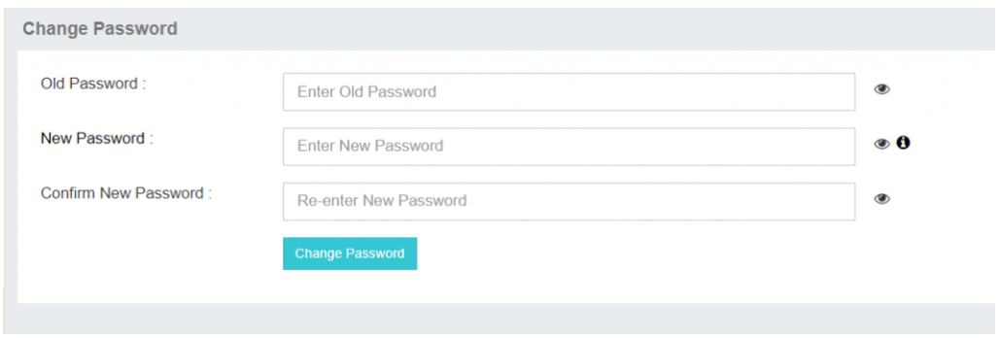

---

### Change Password: Customize Your Password Experience

The **Change Password** feature in iTextPro allows users to update their account password through a secure and user-friendly process. Regular password updates are recommended to maintain strong account security and align with best practices.

---

#### Key Features

- **User-Controlled Security**  
  Change your password anytime to enhance account protection.

- **Simple Process**  
  A clear and easy-to-follow interface ensures minimal hassle.

- **Best Practice Compliance**  
  Encourages regular password updates for stronger account security.

---

#### Steps to Change Your Password

1. **Access Change Password**  
   Navigate to the **Change Password** option under the **Settings** menu.

2. **Enter Current Password**  
   Provide your existing password for verification.

3. **Set a New Password**  
   Enter your new password following the platform’s security requirements.

4. **Confirm the New Password**  
   Re-enter the new password to ensure accuracy.

5. **Save Changes**  
   Click **Save** to update your password.

---

The **Change Password** feature empowers users to proactively safeguard their accounts by maintaining strong, regularly updated credentials.
