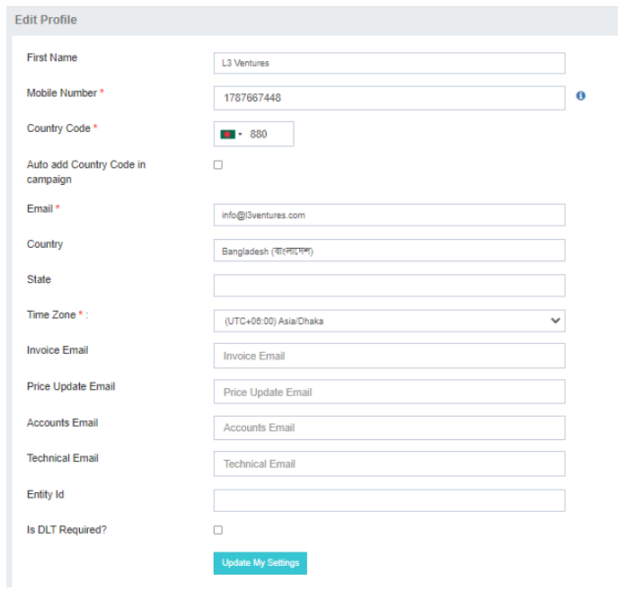

## Settings

In the **Settings** section, users can manage essential account configurations. This section contains the following options:

- **My Profile**
- **Change Password**

---

### My Profile: Manage Your Account Information

The **My Profile** option in iTextPro allows users to manage their basic account details, ensuring accurate and personalized information.

---

#### Key Features

- **First Name**  
  Enter your first name, which will be referenced by the parent account when issuing invoices.

- **Mobile Number**  
  Register your mobile number for account communications and verification.

- **Country Code / Auto-add Country Code**  
  Select your country code to be automatically appended to numbers when sending campaigns. Optionally, enable the auto-add feature for convenience.

- **Email ID**  
  Provide your email address for communication, alerts, welcome emails, OTP verifications, and notifications.

- **Country / State**  
  Specify your country and state for billing and reference purposes.

- **Time Zone**  
  Set your local time zone to ensure all date and time data is displayed accurately according to your location.

---

#### Steps to Manage My Profile

1. **Access My Profile**  
   Go to the **My Profile** section in the Settings menu.

2. **Update Information**  
   Fill in or update fields such as first name, mobile number, country code, email, country, state, and time zone.

3. **Save Changes**  
   Click **Save** to confirm and apply your updates.

---

The **My Profile** feature provides users with control over their account details, enabling a more personalized and efficient experience.
