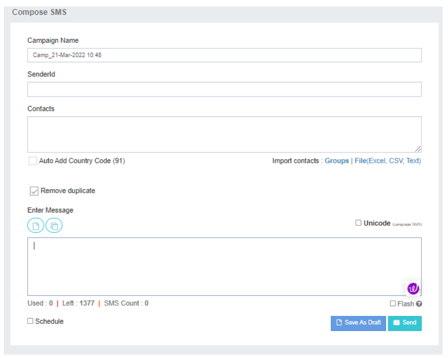

# Compose SMS: A2P SMS Campaigns

In **iTextPro**, the **Compose SMS** feature within the **SMS MT** option provides users with a powerful tool to create and send A2P (Application-to-Person) SMS campaigns. Here's a detailed guide on how to use this feature:

## Open Compose SMS Page
Click on the **SMS MT** option to open the Compose SMS page.

## Campaign Details

### a. Campaign Name
Enter a friendly name for your campaign. By default, a name is automatically generated with the current date-time and the prefix `Camp_`.

### b. Sender ID
Select an approved sender ID from the drop-down menu.  
- If the Admin has disabled the **Open Sender ID Option**, users must choose from the provided list.  
- If enabled, users can enter a dynamic sender ID in a text box. This ID will appear as the sender's address in the recipient's mobile.

### c. Contacts
Choose contacts from:
- Stored groups
- Upload local files
- Manually enter contacts
- Copy-paste them into the text box

Ensure that mobile numbers are comma-separated, starting with the country code (without `+`). Optionally, check the box to automatically add the country code.

### d. Enter Message
Utilize the text box to enter the message.  
- The system displays the last 5 messages for quick reference.  
- A counter at the bottom indicates the message length and count.

### e. Draft And Templates
Select content from existing drafts or templates.  
- **Drafts** can be edited.  
- **Templates** allow modifications only to placeholders.

### f. Flash
Uncheck or check the **Flash** box to control whether the message appears directly on the handset screen.

### g. Unicode
The application detects Unicode messages automatically and checks the Unicode box.

### h. Schedule
Save as a draft or schedule a future campaign.  
The system uses the time zone configured in the user's profile by default.

### i. Send SMS
Clicking on **Send SMS** provides a preview of costs and other details before finalizing the campaign.

---

## Note on Counters
Message and character counters are indicative tools due to browser compatibility and encoding issues.  
It is recommended to test content on a few numbers before large-scale campaigns.

---

## Drafts and Templates
Use saved drafts or templates for efficiency.  
- Drafts can be edited.  
- Templates allow modification of placeholders.

## Flash and Unicode
- Utilize the Flash option for immediate visibility on the handset screen.  
- Enable Unicode for messages in non-Latin scripts.

## Scheduling
Save drafts or schedule future campaigns. The system uses the user's profile time zone by default.

## Send SMS
Clicking **Send SMS** provides a comprehensive preview of costs and details before the final campaign launch.

---

The **Compose SMS** feature in iTextPro empowers users to create personalized and efficient A2P SMS campaigns.  
From customizing sender IDs to scheduling campaigns, this tool provides flexibility and control over every aspect of SMS communication.