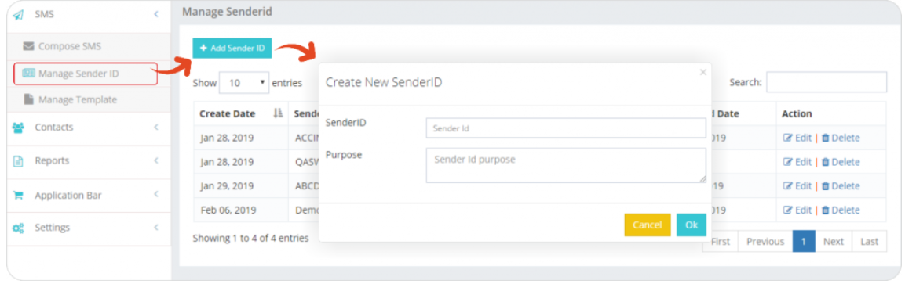

# Manage Sender ID: Configure Source Addresses

iTextPro's **Manage Sender ID** feature empowers users to efficiently configure and oversee source addresses for their SMS campaigns. This section provides an overview of how users can manage sender IDs within the platform.

## Key Functionality

### View and Approve Sender IDs
- Users can access a list displaying all sender IDs along with their respective approval statuses.  
- **Note:** If the account is enabled for *Open Sender ID*, users may choose to skip this configuration.

### Creating a New Sender ID
Users can initiate the creation of a new sender ID by clicking on the **"Add Sender ID"** tab. This action opens a popup box for configuration.

#### Steps to Add a Sender ID

1. **Click on "Add Sender ID" Tab**  
   Access the *Manage Sender ID* section and click on the **"Add Sender ID"** tab.

2. **Popup Configuration Box**  
   A configuration box will appear, allowing users to set up the new sender ID.

3. **Configuration Details**  
   Users can input the necessary details for the new sender ID, following the guidelines provided in the configuration box.

4. **Save and Approval Process**  
   Save the configured sender ID details. Depending on the approval process configured by the admin, the sender ID may go through an approval stage.

### List of Sender IDs
Users can view the complete list of sender IDs, including their approval statuses, in the **Manage Sender ID** section.

### Note on Open Sender ID
If the account is enabled for *Open Sender ID*, users have the flexibility to skip the sender ID configuration process.

---

The **Manage Sender ID** feature in iTextPro streamlines the process of configuring and overseeing source addresses for SMS campaigns. Users can easily add new sender IDs, review their approval statuses, and ensure compliance with platform requirements.
