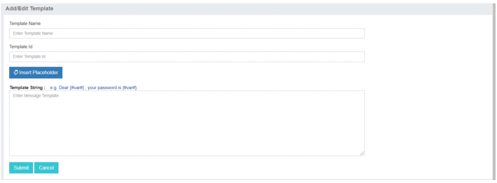

# Manage Template: Configure Static Message Contents

The **Manage Template** feature in iTextPro empowers users to efficiently configure static message contents for their SMS campaigns. This section provides a comprehensive guide on how users can manage templates within the platform.

## Key Functionality

### View and Approve Templates
- Users can access a list displaying all templates along with their respective approval statuses.  
- **Note:** If the account is enabled for **Open Template**, users may choose to skip this configuration.

---

### Creating a New Template
Users can initiate the creation of a new template by clicking on the **"Add Template"** tab. This action opens a popup box for configuration.

#### Steps to Add a Template:
1. **Click on "Add Template" Tab**  
   Access the "Manage Template" section and click on the "Add Template" tab.

2. **Popup Configuration Box**  
   A configuration box will appear, allowing users to set up the new template.

3. **Configuration Details**  
   Users can input the necessary details for the new template, following the guidelines provided in the configuration box.

4. **Inserting Placeholders**  
   Users can insert placeholders by clicking on the **"Insert Placeholder"** button.  
   > Anything other than the placeholder will be treated as static content and cannot be edited while sending messages.

5. **Approval Process**  
   Save the configured template details. Depending on the approval process configured by the admin, the template may go through an approval stage.

---

### List of Templates
- Users can view the complete list of templates, including their approval statuses, in the **Manage Template** section.

---

### Note on Open Template
If the account is enabled for **Open Template**, users have the flexibility to skip the template configuration process.

---

## Important Reminder
Once a template is approved, users can only edit the placeholder portion while sending messages.  
Users utilizing APIs need to exercise caution, as any discrepancies in spacing, commas, or missing full stops may result in an invalid template.

---

The **Manage Template** feature in iTextPro ensures efficient configuration of static message contents, providing users with flexibility and control over their SMS campaigns. Whether approving existing templates or creating new ones, this tool contributes to a seamless and personalized messaging experience.
