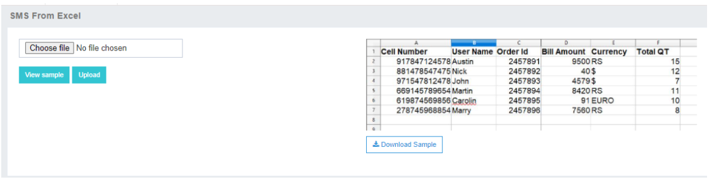
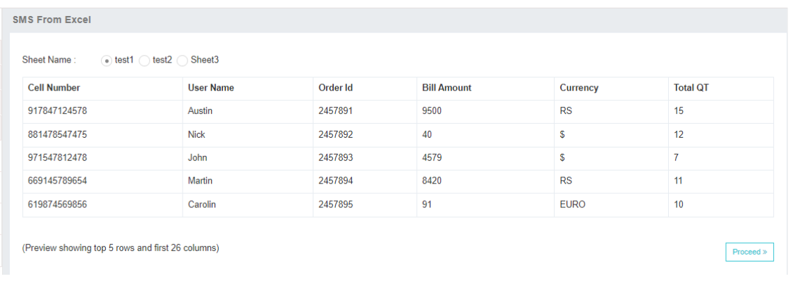
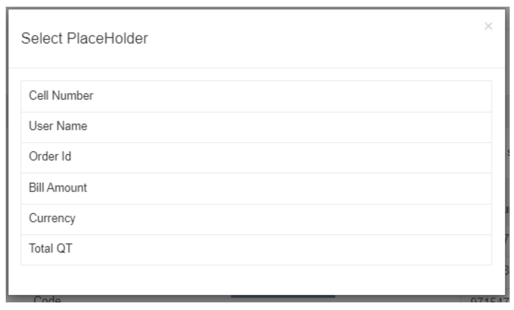
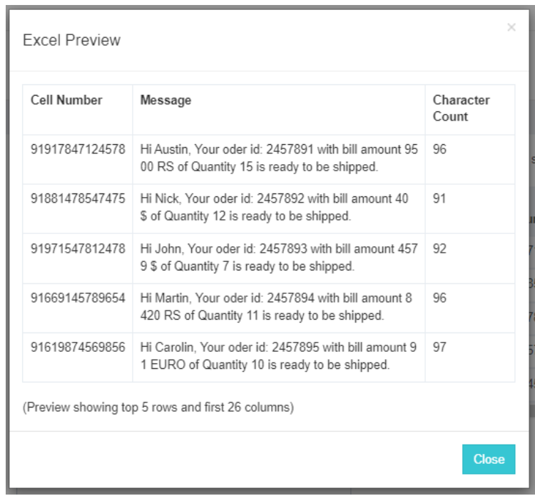
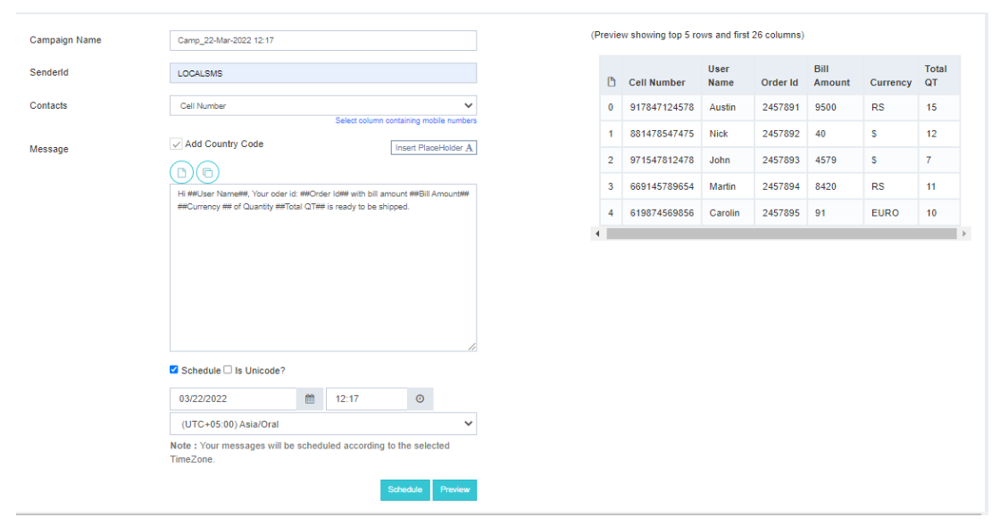
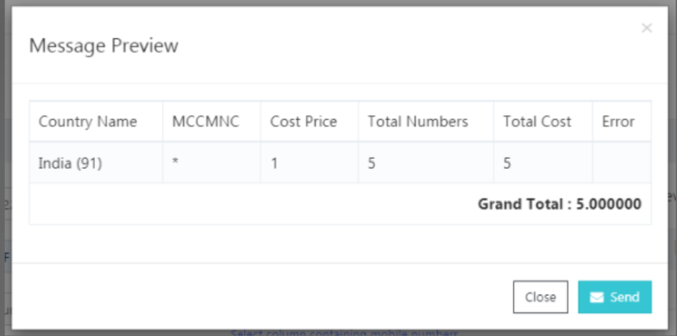

# SMS From Excel: Triggering Campaigns with Excel Files

The **SMS From Excel** tab in *iTextPro* provides users with a streamlined approach to trigger campaigns using an Excel file containing various message content or variables. This feature is particularly useful for sending reminders, personalized promotional offers, and more.

## Key Features

### Excel File Upload
Users can trigger campaigns from an Excel file containing mobile numbers and additional details.

### Sample File Download
Click on the **"View Sample"** tab to download a sample Excel file, providing guidance on the required format.

### Customized Campaigns
Customize campaigns by including recipient names, payment amounts, or any other relevant information in the Excel file.

### Top 5 Rows Display
After uploading the Excel file, the application displays the top 5 rows for user convenience.

### Column Selection
Proceed to select the column containing mobile numbers and enter the sender ID and message content.

### Insert Placeholders
Utilize the **"Insert placeholder"** option to replace placeholders with actual values from the Excel file in the message content.

### Preview
Click the **"Preview"** button to view the top 5 personalized SMS messages along with character counts.

### Scheduling
Users can schedule campaigns for a specific date. The system defaults to the time zone configured in the user's profile.

### Unicode Support
For Unicode message contents, users can enable the Unicode option.

### Final Preview and Send
After clicking the **"Send"** button, the application provides a preview screen with details such as country, total cost, etc. Confirming the message preview screen sends the campaigns.

---

## Usage Guidelines

- **Excel Content**: Organize mobile numbers and additional details in the Excel file.
- **Column Selection**: Choose the column containing mobile numbers and enter sender ID and message content.
- **Insert Placeholders**: Dynamically insert placeholders for personalized content.
- **Preview and Schedule**: View the top 5 messages, check character counts, and schedule campaigns if needed.
- **Unicode Option**: Enable Unicode for non-Latin script message contents.
- **Final Confirmation**: Review details in the preview screen before confirming and sending the campaigns.

---

The **SMS From Excel** feature in *iTextPro* simplifies the process of launching campaigns with personalized content, making it efficient and user-friendly. Whether scheduling campaigns or utilizing Unicode support, this tool offers flexibility for diverse communication needs.
